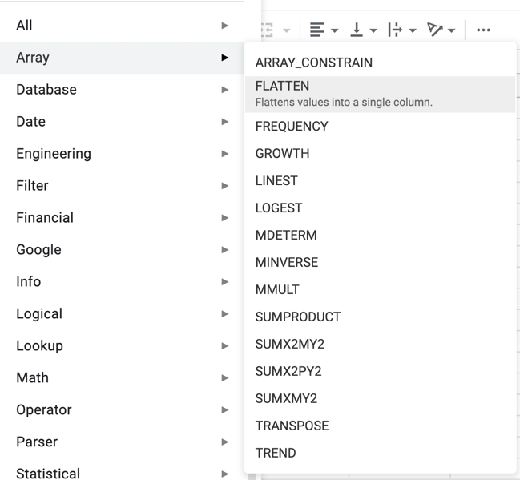

# API Design

## Type and Usage

### Base Type from Python to JavaScript/TypeScript

```ts
type BaseType = 'int' | 'str' | 'list' | 'dict'
```

### Get list of all functions

```ts
const listURL = new URL('/list', API_URL)
type FunctionPreview = {
    /**
     * Unique ID that won't make conflct
     */
    id: string
    name: string
    description: string
    path: `/param/${string}`
}
type ListResponse = {
    list: FunctionPreview[]
}
const response: ListResponse = await fetch(listURL, {
    method: 'GET'
}).then(res => res.json())
const {list} = response
list.map(fn => {
    console.assert(typeof fn.name === 'name')
    console.assert(typeof fn.path === 'string')
    console.assert(fn.path.startsWith('/param/'))
})
```

### Get details of one function

```ts
type FunctionDetail = {
    /**
     * Unique ID that won't make conflct
     */
    id: string
    /**
     * Display Name
     */
    name: string
    /**
     * Params of the function
     */
    params: {
        [key: string]: {
            type: BaseType
            treat_as: 'config' | 'column' | 'cell'
            whitelist?: string[]
            example?: any[]
        }
    }
    /**
     * Output data type
     */
    output_type: {
        [key: string]: BaseType
    }
    /**
     * Where to call this function
     */
    callee: `/call/${string}`
    /**
     * Description of this function
     */
    description: string
}
const fnDetailURL = new URL('/param/xxx', API_URL)
const response: FunctionDetail = await fetch(fnDetailURL, {
    method: 'GET'
}).then(res => res.json())
console.assert(typeof response.id === 'string')
console.assert(typeof response.name === 'string')
console.assert(typeof response.params === 'object')
console.assert(typeof response.output === 'object')
console.assert(typeof response.callee === 'string')
console.assert(typeof response.description === 'string')
```

### Call a function

```ts
const body = {}
type PostResponseSuccess = {
    // we cannot find a type that describe different responses
    [key: string]: any
}
type PostResponseError = {
    "error_type": "wrapper" | "function"
    "error_body": string
}
const response = await fetch(new URL(`/call/xxx`, API_URL), {
    method: 'POST',
    body: JSON.stringify(body),
    headers: {
        'Content-Type': 'application/json'
    }
}).then(res => res.json())
```

## Q&A

1. Why the `description` field among the `FunctionPreview` and `FunctionDetail`?

In the frontend, we will display a list of all function to the client.

Most of the time, user just like lookup a dictionary and search for only one result.



2. What's `id`? Why not just use `name` or `path`?

The `id` is a **unique identifier**.

For example, our `textea-sheet` load two servers' functions

They have the same function which called `plus_a_b`.
They will have same `name` and `path` in this case.

In our frontend, we use
[UUID 4](https://en.wikipedia.org/wiki/Universally_unique_identifier#Version_4_(random))
as standard generator tool of `id`.

## Defects

We cannot tell detail of `dict` and `list` type from python.